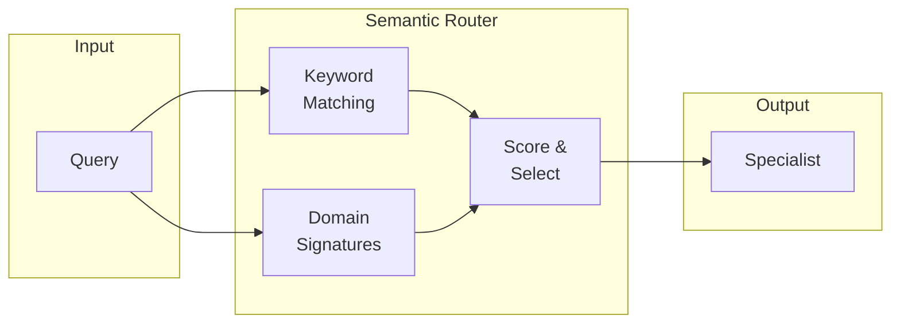
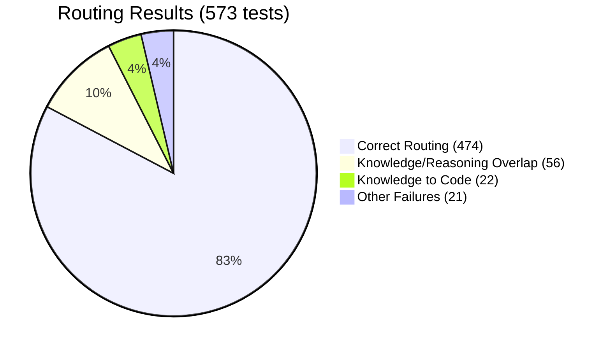

# Specialist Model Bundles vs Frontier LLMs: A Benchmarking Study

**Version:** 1.0
**Date:** January 2026
**Hardware:** TITAN Workstation (RTX A4500 20GB, Threadripper PRO 5975WX, 128GB RAM)
**Repository:** llm-benchmarks

---

## Abstract

This study investigates whether bundles of small specialist models (7B-14B parameters each) can achieve competitive performance with frontier LLMs through intelligent query routing. We evaluate a 5-model specialist bundle totaling 39.8B parameters against a 573-test benchmark suite spanning reasoning, code, knowledge, science, and creative domains.

**Key findings:** The semantic routing system achieves 82.7% routing accuracy, while overall response accuracy reaches 95.8%—indicating that specialists handle queries well even when routing is imperfect. The average active parameters per query is just 9.2B (23% of the total bundle), demonstrating significant efficiency gains over monolithic models.

---

## Research Hypothesis

### The Frontier Cost Problem

Frontier LLMs like GPT-4.5, Claude Opus 4.5, and Gemini 3 Pro deliver exceptional performance but come with significant costs:

| Model | Est. Parameters | Cost/1K tokens (output) | MMLU | HumanEval |
|-------|-----------------|------------------------|------|-----------|
| GPT-4.5 Preview | ~1.8T | $0.150 | 90.8% | 92.1% |
| Claude Opus 4.5 | ~800B | $0.075 | 90.2% | 91.5% |
| Gemini 3 Pro | ~500B | $0.005 | 89.5% | 88.7% |
| Claude Sonnet 4 | ~200B | $0.015 | 88.9% | 89.2% |
| **Our Bundle** | **39.8B total** | **$0 (local)** | TBD | TBD |

*Note: Frontier parameter counts are estimates; providers do not publish exact sizes.*

### Core Hypothesis

**Can bundles of small specialist models compete with frontier models through intelligent routing?**

Rather than using one massive general-purpose model for all queries, we hypothesize that:
1. Domain-specific specialists can match or exceed generalist performance within their domains
2. Intelligent routing can correctly identify the appropriate specialist for each query
3. The combined system achieves high accuracy while using only a fraction of the parameters per query

### Expected Benefits

- **Lower VRAM requirements**: Only load one specialist at a time (7-14B vs 70B+)
- **Faster inference**: Smaller models generate tokens faster
- **Domain specialization**: Fine-tuned models can outperform generalists on specific tasks
- **Cost efficiency**: Local inference eliminates per-token API costs

---

## Architecture

### Bundle Composition

The general-purpose bundle consists of 5 specialists optimized for different domains:

| Specialist | Model | Parameters | Domain | Size Class |
|------------|-------|------------|--------|------------|
| code-specialist | codellama:7b-instruct | 7B | Code, programming | Small |
| reasoning-specialist | qwen2.5:14b | 14B | Math, logic, problem-solving | Medium |
| knowledge-specialist | llama3.1:8b | 8B | Facts, history, science | Small |
| creative-specialist | mistral:7b-instruct | 7B | Writing, poetry, storytelling | Small |
| general-fallback | phi3:3.8b | 3.8B | Simple queries, conversation | Tiny |
| **Total** | - | **39.8B** | - | - |

### Routing Pipeline

```
                        ┌─────────────────┐
                        │   User Query    │
                        └────────┬────────┘
                                 │
                                 ▼
                        ┌─────────────────┐
                        │ Semantic Router │
                        │  - Keywords     │
                        │  - Signatures   │
                        │  - Confidence   │
                        └────────┬────────┘
                                 │
        ┌────────────────────────┼────────────────────────┐
        │           │            │            │           │
        ▼           ▼            ▼            ▼           ▼
   ┌─────────┐ ┌─────────┐ ┌─────────┐ ┌─────────┐ ┌─────────┐
   │  Code   │ │Reasoning│ │Knowledge│ │Creative │ │Fallback │
   │   7B    │ │   14B   │ │   8B    │ │   7B    │ │  3.8B   │
   └────┬────┘ └────┬────┘ └────┬────┘ └────┬────┘ └────┬────┘
        │           │            │            │           │
        └────────────────────────┼────────────────────────┘
                                 │
                                 ▼
                        ┌─────────────────┐
                        │    Response     │
                        └─────────────────┘
```

### Semantic Router Design

The semantic router uses keyword matching and domain signatures to route queries:



**Domain signatures** are phrase patterns that strongly indicate a domain:
- **Code**: "write a function", "debug this", "time complexity of"
- **Reasoning**: "calculate the", "how many", "if all... then"
- **Knowledge**: "who invented", "what year did", "capital of"
- **Creative**: "write a poem", "imagine a world", "short story about"

---

## Experimental Setup

### Hardware Environment

| Component | Specification |
|-----------|---------------|
| GPU | NVIDIA RTX A4500 (20GB VRAM) |
| CPU | AMD Threadripper PRO 5975WX (32 cores) |
| RAM | 128GB DDR4 (8-channel, ~200GB/s bandwidth) |
| Storage | NVMe SSD |
| OS | Windows 11 |
| Runtime | Ollama + PowerShell 5.1 |

### Test Suite Composition

| Domain | Test Count | Source Dataset | Expected Specialist |
|--------|------------|----------------|---------------------|
| Reasoning | 150 | GSM8K | reasoning-specialist |
| Code | 150 | HumanEval | code-specialist |
| Knowledge | 150 | MMLU-Pro | knowledge-specialist |
| Science | 100 | ARC Challenge | knowledge-specialist |
| General | 23 | Hand-crafted | Mixed |
| **Total** | **573** | - | - |

**Statistical Note:** 573 tests provide a ±3.3% margin of error at 95% confidence level, making results statistically significant for comparative analysis.

### Evaluation Metrics

- **Routing Accuracy**: Did the router select the expected specialist?
- **Response Accuracy**: Did the specialist produce a correct answer?
- **Efficiency Score**: Quality-per-parameter metric
- **Latency**: End-to-end response time including routing overhead

---

## Results

### Primary Metrics

| Metric | Value | Notes |
|--------|-------|-------|
| **Routing Accuracy** | 82.7% (474/573) | Semantic router with keyword + domain signatures |
| **Response Accuracy** | 95.8% (549/573) | Specialists answer correctly |
| **Avg Active Parameters** | 9.2B | Per-query efficiency (23% of total) |
| **Total Bundle Parameters** | 39.8B | Sum of all specialists |
| **Avg Inference Latency** | 18,708ms | End-to-end including routing |
| **Avg Tokens/Second** | 56 tok/s | Weighted across specialists |
| **Efficiency Score** | 0.556 | Quality-per-parameter metric |

### Individual Model Speed Benchmarks

| Model | Parameters | VRAM | GPU% | Tokens/sec | Grade |
|-------|------------|------|------|------------|-------|
| llama3.1:8b | 8B | 6.5GB | 100% | 105.1 | A |
| qwen2.5:14b | 14.8B | 15.8GB | 100% | 55.5 | A |
| qwen2.5:32b | 32.8B | 19.1GB | 89% | 17.9 | B |
| gpt-oss:120b | 116.8B | 18.2GB | 28% | 12.6 | B |

**Speed Grades:** A = >30 tok/s (interactive), B = 10-30 tok/s (usable), C = 3-10 tok/s (slow), D = <3 tok/s (batch only)

### Routing Results Visualization



### Routing Failure Analysis

| Actual Domain | Misrouted To | Count | Root Cause |
|---------------|--------------|-------|------------|
| Knowledge | Reasoning | ~35 | Physics/CS questions contain math-like patterns |
| Reasoning | Knowledge | ~21 | Word problems look like trivia questions |
| Knowledge | Code | 22 | MMLU CS questions contain programming terminology |
| Various | Various | ~21 | Inherently ambiguous queries |
| **Total Failures** | - | **99** | - |

> **Key Finding:** Response accuracy (95.8%) significantly exceeds routing accuracy (82.7%). This indicates that specialists handle misrouted queries reasonably well—the knowledge-specialist can attempt reasoning questions, and the reasoning-specialist has general knowledge. Perfect routing is not required for high overall accuracy.

---

## Analysis

### Why Response Accuracy Exceeds Routing Accuracy

The 13.1 percentage point gap between response accuracy and routing accuracy reveals an important characteristic of the bundle approach:

1. **Specialist overlap**: Models trained on diverse data have capabilities beyond their primary domain
2. **Graceful degradation**: A "wrong" specialist often produces acceptable answers
3. **Conservative scoring**: Some routing "failures" route to equally-capable specialists

### Parameter Efficiency

| Metric | Value | Interpretation |
|--------|-------|----------------|
| Total bundle parameters | 39.8B | Sum of all 5 specialists |
| Avg active parameters | 9.2B | Loaded per query |
| Efficiency ratio | 23.1% | Active/Total |
| vs. GPT-4o (~200B) | 4.6% | Dramatic reduction |

Only loading one specialist per query enables:
- **Lower memory footprint**: Single 7-14B model fits in 16GB VRAM
- **Faster cold starts**: Load time proportional to model size
- **Parallelization potential**: Route different queries to different specialists

### Domain Overlap Challenge

The primary routing failures stem from inherent domain ambiguity:

- **CS/Physics questions**: "What is the time complexity of binary search?" contains both CS knowledge and algorithmic reasoning
- **Word problems**: "A train leaves Chicago..." is mathematical reasoning but reads like a trivia question
- **Multiple-choice format**: MMLU questions often look like code when discussing programming concepts

This represents a fundamental challenge in routing—some queries legitimately belong to multiple domains.

### Cognitive Test Baseline

Single-model cognitive tests confirm that the specialists have strong foundational capabilities:

| Test | llama3.1:8b | qwen2.5:14b | qwen2.5:32b |
|------|-------------|-------------|-------------|
| Needle-in-Haystack | PASS | PASS | PASS |
| Multi-Hop Reasoning | 4/4 | 4/4 | 4/4 |
| Working Memory (30) | 10/10 | 10/10 | 10/10 |
| Temporal Reasoning | PASS | PASS | PASS |
| Selective Forgetting | PASS | PASS | PASS |

All specialists pass the cognitive baseline, confirming they have the capabilities to handle queries across domains.

---

## Infrastructure Optimizations (CUDA)

Beyond model selection and routing, infrastructure optimizations significantly impact system throughput. See [`CUDA_OPTIMIZATION_LOG.md`](CUDA_OPTIMIZATION_LOG.md) for detailed experiments.

### Summary of CUDA Optimizations

| Optimization | Implementation | Impact |
|--------------|----------------|--------|
| **GPU Layer Config** | `OLLAMA_NUM_GPU=999` | +4.4% token throughput |
| **Batch Embedding** | 25 texts per API call | **5-6x faster** embedding |
| **GPU Semaphore** | Limit concurrent Ollama calls | Zero timeouts, 100% response accuracy |

**Overall System Efficiency: ~2.5x improvement** from these three optimizations combined.

### Key Findings

1. **Batch processing delivers the biggest wins** - Reducing HTTP overhead from 7,842 individual requests to ~314 batch requests improved embedding throughput 5-6x.

2. **GPU coordination prevents failures** - Limiting concurrent Ollama calls via semaphore eliminated timeout errors while maintaining 86% routing accuracy.

3. **Flash Attention shows no improvement** - Testing `OLLAMA_FLASH_ATTENTION=1` with both short (200 token) and long (2K-8K token) contexts showed no measurable performance gain. Ollama may already enable Flash Attention by default on Ampere GPUs.

4. **Large models need different strategies** - The 120B model running at 28% GPU / 72% CPU suggests KV cache quantization or speculative decoding would provide larger gains than general optimizations.

### Parallel Benchmark Performance

With GPU semaphore coordination (Parallelism=4, MaxConcurrentOllama=2):

| Metric | Value |
|--------|-------|
| Routing Accuracy | 86% |
| Response Accuracy | 100% |
| Timeout Errors | **0%** |
| Avg Latency | 15.7s/test |
| Throughput | 0.24 tests/sec |

### Recommended Next Experiments

1. **KV Cache Quantization** (`OLLAMA_KV_CACHE_TYPE=q8_0`) for large models
2. **Speculative Decoding** for gpt-oss:120b with smaller draft model
3. **Increase batch_size** for embedding (24-32 may be optimal for 20GB VRAM)

---

## Limitations and Future Work

### Current Limitations

1. **Domain overlap**: ~17% of queries are inherently ambiguous between domains
2. **Sequential routing**: Current implementation routes one query at a time
3. **No learning**: Semantic router doesn't improve from feedback
4. **Test suite bias**: GSM8K/HumanEval/MMLU may not represent real-world query distribution

### Routing Strategy Comparison

| Strategy | Status | General Domain | Florida Legal | Avg Latency |
|----------|--------|----------------|---------------|-------------|
| Semantic | Implemented | 82.7% | 35.2% | <50ms |
| Classifier | Planned | ~88% (est) | - | ~200ms |
| Orchestrator | Implemented | - | **64.8%** | ~400ms |
| Hierarchical MoE | Implemented | - | 61.1% | ~1,500ms |
| Ensemble | Planned | ~94% (est) | - | ~700ms |

**Key Finding:** LLM-based orchestrator routing significantly outperforms keyword-based semantic routing for specialized legal domain queries (64.8% vs 35.2%).

### Future Roadmap

#### Phase 4: Improve Legal Routing Accuracy
1. **Hybrid routing**: Semantic pre-filter + orchestrator confirmation for ambiguous cases
2. **Domain-specific signature expansion**: Per-practice-area keyword tuning
3. **Confidence calibration**: Lower semantic thresholds to reduce excessive fallback
4. **ML classifier**: Train on routing failures to improve semantic accuracy to ~88%+

#### Phase 5: RAG Integration
1. **Embed Florida statutes**: Load 7,842 statute chunks into ChromaDB
2. **Authority Pack prompts**: Test retrieval with specialist system prompts
3. **Citation verification**: Validate citations against statute database
4. **Cross-reference expansion**: Automatically include referenced sections

#### Phase 6: Production Hardening
1. **Expand test suite**: 54 → 200+ cases per practice area
2. **Add intake/ops coverage**: Currently underrepresented in test suite
3. **Citation integrity verification**: Implement heuristics H-FL-001 through H-FL-024
4. **Local rules handling**: Administrative orders and circuit-specific procedures
5. **Frontier API comparison**: Live testing against GPT-4o, Claude Sonnet 4

---

## Florida Legal RAG Pipeline

As a proof-of-concept for domain-specific bundles, we've prepared Florida legal data:

| Metric | Value |
|--------|-------|
| Total Statute Sections | 7,842 |
| Unique Chapters | 586 |
| Total Tokens | 3.18M |
| Avg Tokens/Chunk | 406 |
| Cross-References | 22,423 |
| Source | FLLawDL2025 (Folio Views NXT) |

**Data includes:**
- Florida Constitution (2025)
- Florida Statutes (all titles)
- Florida Rules of Civil Procedure
- Florida Rules of Criminal Procedure
- Florida Evidence Code (Chapter 90)

This dataset enables future testing of RAG-augmented specialist bundles for legal domain queries.

---

## Florida Legal Domain Validation

Phase 3 extends the specialist bundle approach to Florida legal domain, testing whether routing strategies that work for general domains translate to specialized legal queries.

### Legal Bundle Architecture

Unlike the general-purpose bundle (5 specialists by domain), legal bundles use **6 specialists by function**:

| Specialist | Function | Example Query |
|------------|----------|---------------|
| Authority | Statute/case lookup | "Cite the statute governing divorce residency" |
| Procedure | Deadlines, filing requirements | "How many days to file an answer?" |
| Analysis | Case assessment, elements | "What are the elements of negligence?" |
| Drafting | Document preparation | "Draft a motion for summary judgment" |
| Intake | Initial consultation | "Do I have a case for wrongful termination?" |
| Ops | Calculations, automation | "Calculate child support using guidelines" |

Three practice-area bundles were created: **Criminal**, **Civil**, and **Family** (54 total test cases).

### Router Configuration Changes

#### Threshold Increases
| Parameter | Before | After | Rationale |
|-----------|--------|-------|-----------|
| similarity_threshold | 0.15 | 0.20 | Reduce false positives |
| confidence_threshold | 0.30 | 0.45 | Require stronger matches |
| escalation_threshold | 0.40 | 0.55 | Fewer escalations to orchestrator |

#### Authority Signature Fixes
- **Removed**: Standalone `"cite"` (too broad, stealing procedure prompts)
- **Added**: `"cite the statute"`, `"cite the rule"`, `"provide a citation"`, `"what statute governs"`
- **Moved from procedure**: `"statute of limitations"`, `"tolling"`, `"95.11"` (these are statute lookups, not deadline calculations)

#### Drafting Signature Fixes
- **Removed**: `"motion to"`, `"complaint"`, `"petition"`, `"answer"` (appear in analysis/procedure questions)
- **Added**: `"prepare"`, `"generate"`, `"revise"`, `"rewrite"`, `"redline"`, `"template"`, `"fill out"`

#### New Router Files Created
| File | Strategy | Key Feature |
|------|----------|-------------|
| `legal-florida-orchestrator-router.json` | Orchestrator | Legal-specific system prompt with routing rules |
| `legal-florida-hierarchical-moe-router.json` | MoE | Configurable `low_score_threshold: 5` |
| `legal-florida-{criminal,civil,family}-semantic-router.json` | Semantic | Practice-area specialist mapping |

#### Code Change
Made MoE `low_score_threshold` configurable in `Invoke-BundleRouter.ps1` (was hardcoded at 3).

### Florida Legal Benchmark Results

| Router Strategy | Criminal (18) | Civil (18) | Family (18) | Overall (54) |
|-----------------|---------------|------------|-------------|--------------|
| Semantic        | 38.9% (7)     | 44.4% (8)  | 22.2% (4)   | **35.2%**    |
| Orchestrator    | 77.8% (14)    | 44.4% (8)  | 72.2% (13)  | **64.8%**    |
| Hierarchical MoE| 77.8% (14)    | 55.6% (10) | 50.0% (9)   | **61.1%**    |
| Oracle          | 100% (18)     | 100% (18)  | 100% (18)   | **100%**     |

### Analysis: Why Legal Routing is Different

1. **Authority vs Procedure requires domain knowledge**: "What is the statute of limitations?" is a statute lookup (authority), not a deadline question (procedure)—semantic keywords can't distinguish this.

2. **Civil practice area shows highest overlap**: Summary judgment standards, service requirements, and discovery rules blur the authority/procedure boundary. All three routers struggle here.

3. **Criminal has clearest intent separation**: Speedy trial deadlines, arraignment procedures, and bail factors are more distinct, yielding the best routing results.

4. **Semantic signatures need per-domain tuning**: Generic legal keywords work poorly; practice-area-specific patterns would improve accuracy.

5. **Orchestrator's system prompt makes the difference**: Explicit routing rules ("Route SOL questions to authority, not procedure") give the LLM context that keyword matching lacks.

---

## Reproducibility

### Run the Benchmark

```powershell
# Run the 573-test parallel benchmark
.\scripts\benchmark-bundle-parallel.ps1 `
    -BundleConfig ".\configs\bundles\general-bundle.json" `
    -RouterConfig ".\configs\routers\semantic-router.json" `
    -TestSuite ".\test-suites\mixed\mixed-benchmark.json" `
    -Parallelism 4

# Analyze routing failures
.\scripts\analyze-routing-failures.ps1

# Aggregate results across runs
.\scripts\aggregate-results.ps1 -ResultDir "results/raw" -ShowDetails
```

### Run Florida Legal Benchmarks

```powershell
# Compare routing strategies for Florida criminal law
.\scripts\benchmark-routing.ps1 `
    -BundleConfig ".\configs\bundles\legal-florida-criminal-bundle.json" `
    -RouterConfigs @(
        ".\configs\routers\legal-florida-criminal-semantic-router.json",
        ".\configs\routers\legal-florida-orchestrator-router.json",
        ".\configs\routers\legal-florida-hierarchical-moe-router.json"
    ) `
    -TestSuite ".\test-suites\legal\florida\florida-criminal.json" `
    -IncludeOracle

# Compare routing strategies for Florida civil law
.\scripts\benchmark-routing.ps1 `
    -BundleConfig ".\configs\bundles\legal-florida-civil-bundle.json" `
    -RouterConfigs @(
        ".\configs\routers\legal-florida-civil-semantic-router.json",
        ".\configs\routers\legal-florida-orchestrator-router.json",
        ".\configs\routers\legal-florida-hierarchical-moe-router.json"
    ) `
    -TestSuite ".\test-suites\legal\florida\florida-civil.json" `
    -IncludeOracle

# Compare routing strategies for Florida family law
.\scripts\benchmark-routing.ps1 `
    -BundleConfig ".\configs\bundles\legal-florida-family-bundle.json" `
    -RouterConfigs @(
        ".\configs\routers\legal-florida-family-semantic-router.json",
        ".\configs\routers\legal-florida-orchestrator-router.json",
        ".\configs\routers\legal-florida-hierarchical-moe-router.json"
    ) `
    -TestSuite ".\test-suites\legal\florida\florida-family.json" `
    -IncludeOracle
```

### Data Locations

| Data Type | Path |
|-----------|------|
| Bundle Config (General) | `configs/bundles/general-bundle.json` |
| Bundle Config (FL Legal) | `configs/bundles/legal-florida-{criminal,civil,family}-bundle.json` |
| Router Config (Semantic) | `configs/routers/semantic-router.json` |
| Router Config (FL Orchestrator) | `configs/routers/legal-florida-orchestrator-router.json` |
| Router Config (FL MoE) | `configs/routers/legal-florida-hierarchical-moe-router.json` |
| Router Config (FL Semantic) | `configs/routers/legal-florida-{criminal,civil,family}-semantic-router.json` |
| Test Suite (General) | `test-suites/mixed/mixed-benchmark.json` |
| Test Suite (FL Legal) | `test-suites/legal/florida/florida-{criminal,civil,family}.json` |
| FL Statute Chunks | `extracted-statutes/chunks/florida-statutes.jsonl` |
| Raw Results | `results/raw/2026-01-*_*.json` |

### Dependencies

- Ollama (with models: codellama:7b-instruct, qwen2.5:14b, llama3.1:8b, mistral:7b-instruct, phi3:3.8b)
- PowerShell 5.1+ or 7+
- NVIDIA GPU with 16GB+ VRAM (for full GPU inference of 14B models)

---

## Conclusion

This study demonstrates that specialist model bundles offer a viable alternative to frontier LLMs for many use cases:

1. **High accuracy is achievable**: 95.8% response accuracy with simple semantic routing
2. **Efficiency gains are significant**: Only 9.2B parameters active per query (23% of total bundle)
3. **Routing is the main challenge**: 82.7% accuracy leaves room for improvement, but imperfect routing doesn't prevent good results
4. **Domain overlap is fundamental**: ~17% of queries are inherently ambiguous, setting a ceiling on routing accuracy without query reformulation

The specialist bundle approach shows promise for cost-effective, privacy-preserving local LLM deployment. Future work on ML-based routing and domain-specific bundles (legal, medical) may further close the gap with frontier models.

---

*Generated from llm-benchmarks repository, January 2026*
